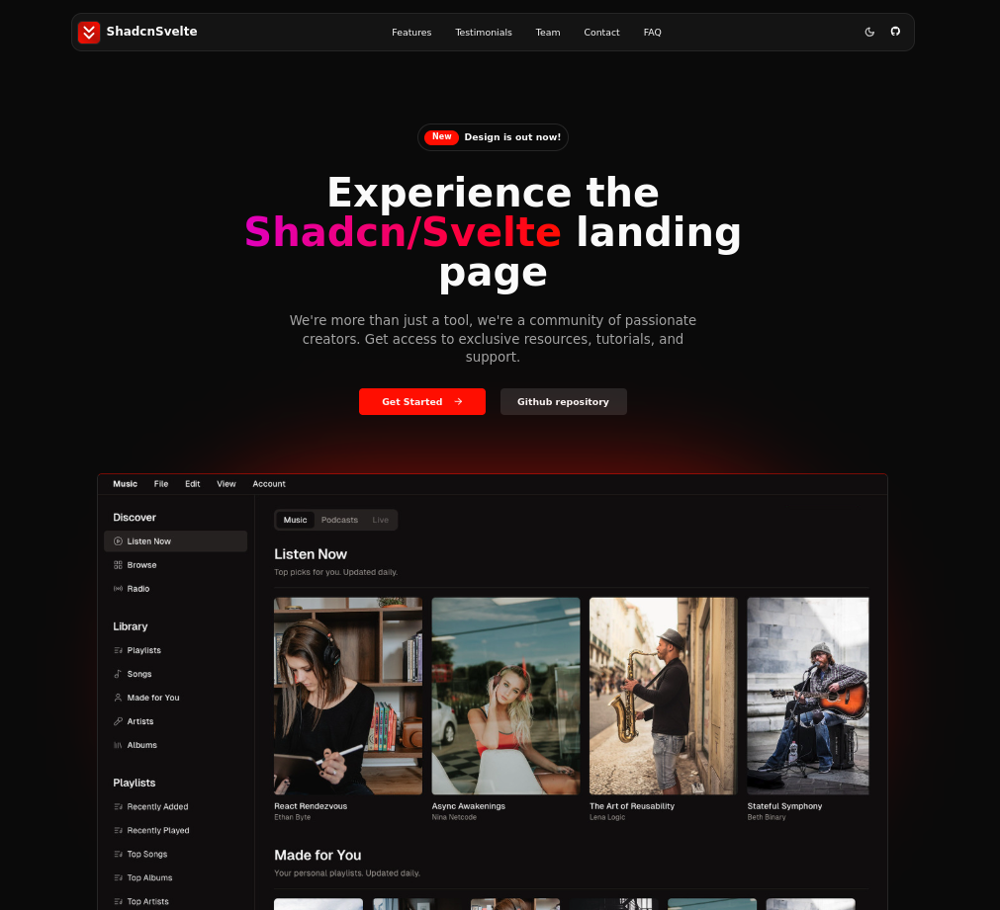

# Gift Recommender Frontend

This is the frontend application for the Gift Recommender project, built with SvelteKit, TypeScript, and Tailwind CSS. It leverages Shadcn/Svelte components for a modern and responsive user interface.

## Technologies Used

*   **[Shadcn-Svelte](https://www.shadcn-svelte.com/)**: UI component library.
*   **[SvelteKit](https://kit.svelte.dev/)**: Web framework for building Svelte applications.
*   **[TypeScript](https://www.typescriptlang.org/)**: Typed superset of JavaScript.
*   **[Tailwind CSS](https://tailwindcss.com/)**: Utility-first CSS framework.



## Live Demo

A live demo of the application will be available soon.

## Sections

The application includes the following key sections:

*   Navbar
*   Sidebar (mobile)
*   Hero
*   Benefits
*   Features
*   Services
*   How It Works
*   Pricing
*   FAQ
*   Community
*   Contact
*   Footer

## Features

*   Fully Responsive Design
*   User-Friendly Navigation
*   Dark Mode Support
*   Optimized Meta Tags

## How to Install

1.  **Clone this repository:**

    ```bash
    git clone https://github.com/your-username/gift-recommender-frontend.git
    ```

2.  **Navigate to the project directory:**

    ```bash
    cd gift-recommender-frontend
    ```

3.  **Install dependencies:**

    ```bash
    npm install
    # or
    pnpm install
    # or
    yarn install
    # or
    bun install
    ```

4.  **Run the development server:**

    ```bash
    npm run dev
    # or
    pnpm dev
    # or
    yarn dev
    # or
    bun dev
    ```

5.  **Open your browser** and visit `http://localhost:5173`.

## Building for Production

To create a production-ready version of your app:

```bash
npm run build
```

You can preview the production build locally with:

```bash
npm run preview
```

> To deploy your app, you may need to install an [adapter](https://kit.svelte.dev/docs/adapters) for your target environment.
